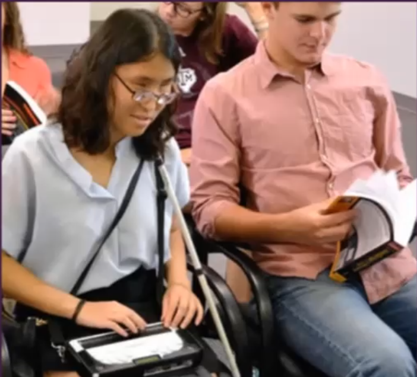

# Images: Alternative Content for Accessibility

## Presenters

- Emily Lewis
    + (she/her/hers)
    + Accessibility Analyst & Universal Design Specialist | Knowbility
    + Formerly Bright Umbrella, CTRL+CLICK CAST & Web Standards Sherpa
    + Front-end developer
    + [emily@knowbility.org](mailto:emily@knowbility.org)
    + [LinkedIn](https://www.linkedin.com/in/emilyplewis)
- Anthony Vasquez
    + Communication Specialist, Accessibility Tester | Knowbility
    + Journalism Instructor - Cal State Long Beach
    + Screan reader expert
    + [avasquez@knowbility.org](mailto:avasquez@knowbility.org)

## Resources

All webinar resources, including code examples, demos, and articles: [https://knowbility.org/services/online-training/image-alternatives/webinar-resources](https://knowbility.org/services/online-training/image-alternatives/webinar-resources)

## This Webinar is *Not* About

- Visual design
- Contrast
- Color
- Motion
- Animation
- File formats or optimization

## What You *Can* Expect

- Deep dive into alternative content for images
- Both user experience perspectives and development techniques
- Screen reader demos and code examples
- Time to ask questions

## Agenda

- What are Images?
- WCAG Requirements
- Text Alternatives (The Science)
- Subjectivity (The Art)
- Functional, Informative, and Decorative Images
- Describing Images (The Art)
- Roles and Responsibilities

## What are Images?

We are really talking about *non-text content*, such as illustrations, photographs, icons, charts, graphs.

May be implemented using `` `<canvas>` `<svg>` tags, or also in epubs.

## WCAG Requirements

[WCAG success criterion 1.1.1 Non-text content](https://www.w3.org/WAI/WCAG21/Understanding/non-text-content.html)

- Descriptive alt text for functional and informative images
- Extended descriptions for more complex imagery
- Hide purely decorative imagery from screen readers

## Text Alternatives (The Science)

### Alt Text

- General, informative sentence
- Provides accessibile name for images
- Can provide accessible name for controls that contains images
- Screen readers announce this alt text to users

#### Alt Text, In Practice

[*CodePen* - Alt text for `` and `<svg>`](https://codepen.io/emilyplewis/pen/abpKqGg?editors=1000)

- For an ``, use the `alt` attribute
- For an `<svg>` there are a couple options:
    + `aria-label` attribute:
        * `<svg xmlns="..." role="img" aria-label="Knowbility"><path /></svg>`
    + `<title>` tag (immediate child of `<svg>` tag):
        * `<svg xlmns="..." role="img"><title>Knowbility</title><path /></svg>`

### Extended Descriptions

- Long/enhanced description
- Visual text content (not hidden content)
- Different formats, structure
- Accessible to everyone

#### Extended Descriptions, In Practice

- Linked descriptions
- Components such as an accordion or modal dialog
- [*Codepen* - Extended description with surrounding text](https://codepen.io/emilyplewis/pen/LYxrdPN?editors=1000)
- [*Codepen* - Extended description with `<figcaption>`](https://codepen.io/emilyplewis/pen/poRKaxO?editors=1000)
    + Image still gets an `alt` attribute

#### Extended Descriptions, In the Real World

[*US Climate Data* - Data tables as text alternatives for bar graph](https://www.usclimatedata.com/climate/los-angeles/california/united-states/usca1339)

### Which Text Alternative to Use?

**Alt Text**  
- "Simple" images
- Relatively brief
- Obvious, general visual information
- Control purpose

**Extended Descriptions**  
- "Complex" images
- Relatively long
- Detailed visual information
- Data, relationships within charts and graphs

## Subjectivity (The Art)

### The Bare Minimum

- **Descriptive** `alt` text for **functional** and **informative** images
- Extended descriptions for more **complex** imagery
- Hide purely **decorative** imagery from screen readers

But all of these come with some level of subjectivity, and this is reliant on context within the page.

### What's Best for Your Images?

- Content goals
- Business goals
- Brand values
- Available resources

At the end of the day, it's about people, about your users and how you want them to connect with you.

### Alt Text, In the Real World

[**Video Demo:** *The Atlantic* homepage using NVDA to explore images](https://vimeo.com/537393748/f23504863e)

For more verbose `alt` text descriptions, the screen reader can simply mute and move on from the image if they feel it's too long or not interesting to them. Could be good to lean toward being more descriptive rather than less.

## Functional, Informative, and Decorative Images

### "Descriptive" Depends on the Image

[WAI an alt decision tree](https://www.w3.org/WAI/tutorials/images/decision-tree/)

### Functional Images

- If the only content of a control (link or button) is an image, then that image is a **functional image**.
- Descriptive = Control purpose
    + Link: description should be the destination
    + Button: description should be "Print page" rather than describing that it's a picture of a printer
- You can still provide visual description if you find it adds value or meaning, but you should frontload the purpose or functionality
- [WAI Functional Images](https://www.w3.org/WAI/tutorials/images/functional/)
- [*Codepen* - Button with `<svg>`](https://codepen.io/emilyplewis/pen/PoWaQvJ?editors=1000)

### Informative Images

- Contributes to understanding of content/page
- Descriptive = Obvious, general visual information
- [WAI Informative Images](https://www.w3.org/WAI/tutorials/images/informative/)

#### Informative Images, In the Real World

[**Video Demo:** *REI* homepage using NVDA to examine promotional images](https://vimeo.com/537396420/6bb8285b65).

- For products, it could be significant to say "Thumbnail of Cotopaxi shoes" or "Thumbnail of Victory blanket".
- Punctuation also matters and introduces pauses and spaces; this can help the user to process language

### Decorative Images

Hide purely **decorative** imagery from screen readers.

- Doesn't add meaning to the content/page
- `alt` text would be redundant to real text
- [WAI Decorative Images](https://www.w3.org/WAI/tutorials/images/decorative/)
- [*Codepen* - Decorative `` and `<svg>`](https://codepen.io/emilyplewis/pen/VwPdQom?editors=1000)

\* Every `` must have an `alt` attribute, otherwise it's invalid and is a WCAG violation.

- Decorative ``:
    + Empty `alt`
    + ``
- Decorative `<svg>`:
    + ARIA: `aria-hidden="true"`
    + Optional best practice is `focusable="false"`
    + `<svg aria-hidden="true" focusable="false" />`

## Describing Images (The Art)

### Be informative and clear

- Front-load the most important information
    + "Joey Reyes Headshot"
- Move from general to specific
    + "Illustration of two friends eating ice cream cones"
- Simple, precise language
    + Find a simpler word rather than something long
    + Be as informative and clear as possible
- Follow [Plain Language techniques](https://www.plainlanguage.gov/)

### Be Accurate

- Proper spelling, grammar, and punctuation
- Write out acronyms
- Write out symbols
- No line breaks (doesn't pertain to extended descriptions)

### Be Neutral

- Don't interpret thoughts or feelings
- Don't instruct
- Don't add more than what's in the image

### Reduce Redundancy

- Don't repeat caption or surrounding text
- Cut unnecessary phrases
    + For example, "This figure shows"

### Less is More

- No length limits, but...
    + 125 character recommendations on the internet seem to be based on how JAWS works; gives a pause after 125 characters
- Consider how screen readers process
- Consider cognitive load, auditory fatigue

### Context is Key

Context is everything from your users to content on the page to business goals to values. The following are guidelines

#### Logos

- `alt` text just needs company/organization name
- Don't need to include "logo"
- Don't need to describe what the logo looks like

#### Headshots

- Person's name is usually sufficient for `alt` text
    + Might also include "headshot", i.e., "Joey Reyes headshot."
- Don't include identity information unless relevant to context
    + i.e., race or gender
    + If you include that information, make sure it gets approval from the people in the headshot
- Depending on context, could be decorative
    + If it's on company directory, the name may already be on the bio page

#### Photography

- Aim to describe in `alt` text unless very complicated
- "At a glance" of main subject and actions
- If needed, extended description may include:
    + Visible emotions
    + Location, conditions
    + Source, photographer

##### Photography `alt` Text, In Practice

- **Okay:** AccessU attendees.
- **Good:** Two attendees seated in the audience at AccessU.
- **Better:** Two attendees seated side-by-side in the audience at AccessU. One is using a braille display, while the other is flipping through a text book.

##### Ecommerce Photos

- Product name for `alt` text when linked to detail page
- On detail page, `alt` text depends on surrounding text
- Images for styles/options should be descriptive
- [**Video Demo** - Anthropologie Product color choices using NVDA](https://vimeo.com/537399582/cab687760a)

#### Graphs and Charts

##### `alt` Text for Graphs and Charts

- Type of chart/graph
- Type of data
- What is meaningful
- [Writing Alt Text for Data Visualization](https://medium.com/nightingale/writing-alt-text-for-data-visualization-2a218ef43f81)

##### Extended Descriptions for Graphs and Charts

- Describe the visual impact
- Describe the relationships of the data
- Describe why you're including this chart
- [The DAISY Consortium webinar series](https://daisy.org/webinar-series/)

## Roles and Responsibilities

**Challenge Assumptions**

- "Good" `alt` text is a skill; it's microcopy
- Extended descriptions need expert input
- Going beyond WCAG conformity requires a team effort

### Text Alternative Team

`alt` text is a collaborative effort!

- Marketing, web designers
- Content strategists
- Copywriters, editors
- Content authors
- Quality assurance testers
- Project managers, team leads

## Questions

**Q:** When would you use the [`longdesc` attribute](https://www.w3schools.com/tags/att_img_longdesc.asp)?  
**A:** It's very rare and somewhat clunky. Basically avoide it.

**Q:** How long should the text be in an an `alt` attribute?  
**A:** Generally speaking, there is no limit. But you do want to keep in mind that `alt` text is supposed to be general, at a glance info about an image. Anything beyond that should direct you to using an Extended Description. Use full sentences and punctuation if that's necessary to describe the image.

**Q:** How do you handle `alt` text for really complicated infographics or technical charts?
**A:** Alt text describes the image at a high level, and the Extended Description will have the complicated data, tables, links to Excel spreadsheets, descriptions in various paragraphs.

